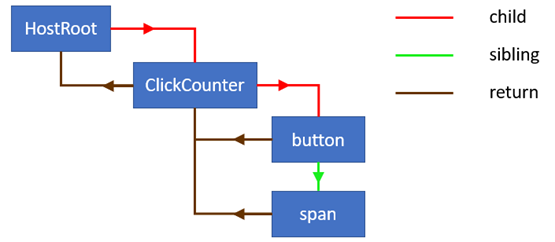
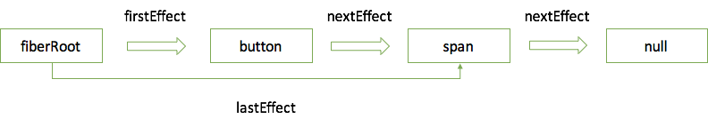

### 渲染机制

渲染机制主要分为两部分: 首次渲染和更新渲染。

#### 首次渲染

首先通过一个小例子，来讲解首次渲染过程。

```html
<!DOCTYPE html>
<html lang="en">
  <head>
    <meta charset="utf-8">
    <title>React App</title>
  </head>
  <body>
    <div id="root"></div>
  </body>
</html>
```

```jsx
import React from 'react';
import ReactDOM from 'react-dom';

class ClickCounter extends React.Component {
  constructor(props) {
    super(props);
    this.state = { count: 0 };
  }
  handleClick = () => {
    this.setState((state) => {
      return {count: state.count + 1};
    });
  }
  render() {
    return [
      <button key="1" onClick={this.handleClick}>Update counter</button>,
      <span key="2">{this.state.count}</span>,
    ]
  }
}
ReactDOM.hydrate(<ClickCounter />, document.getElementById('root'));
```

程序运行到`ReactDOM.hydrate`时，其中的`<ClickCounter />`已被`babel`转换为`React.createElement(ClickCounter, null)`，生成的`element`如下:

```
{
    $$typeof: Symbol(react.element),
    key: null,
    props: {},
    ref: null,
    type: ClickCounter
}
```

接下来执行`hydrate`函数，生成`root`节点。首先了解下`fiber`的部分数据结构。

- alternate（对应的`workInProgress`或`fiber`）
- stateNode（关联的`fiber`，组件实例或者`DOM`节点）
- type（组件或`HTML tag`，如`div`，`span`等）
- tag（类型，详见[workTags](https://github.com/facebook/react/blob/master/packages/shared/ReactWorkTags.js)）
- effectTag（操作类型，详见[sideEffectTag](https://github.com/facebook/react/blob/master/packages/shared/ReactSideEffectTags.js)）
- updateQueue（更新队列）
- memoizedState（`state`）
- memoizedProps（`props`）
- pendingProps（`VDOM`）
- return（父`fiber`）
- sibling（兄弟`fiber`）
- child（孩子`fiber`）
- firstEffect（第一个待处理的`effect fiber`）
- lastEffect（最后一个待处理的`effect fiber`）

首次渲染会以同步渲染的方式进行渲染，首先创建一个`update`，将`element`装载到其`payload`属性中，然后合并到`root.current.updateQueue`，如果没有`updateQueue`会创建一个。我们暂且将`root.current`看成`HostRoot`。

接着根据`HostRoot`克隆一棵`workInProgress`更新树。将`HostRoot.alternate`指向`workInProgress`，`workInProgress.alternate`指向`HostRoot`。然后进入`workLoop`进行更新树操作部分。`workLoop`的任务也很简单，就是将所有节点的更新挂载到更新树上。下面详细看看`reconciliation`阶段。

#### reconciliation阶段

`reconciliation`的核心在于`workLoop`。`workLoop`会以`workInProgress`为起点，即克隆的`HostRoot`，不断向下寻找。如果`workInProgress.child`不为空，会进行`diff`；如果为空会创建workInProgress.child`。

```js
// 第一次循环nextUnitOfWork为workInProgress
function workLoop(isYieldy) {
  if (!isYieldy) {
    // Flush work without yielding
    while (nextUnitOfWork !== null) {
      nextUnitOfWork = performUnitOfWork(nextUnitOfWork);
    }
  } else {
    // Flush asynchronous work until there's a higher priority event
    while (nextUnitOfWork !== null && !shouldYieldToRenderer()) {
      nextUnitOfWork = performUnitOfWork(nextUnitOfWork);
    }
  }
}
```

因为只涉及首次渲染，所以这里将`performUnitOfWork`简单化。`beginWork`根据`workInProgress.tag`选择不同的处理方式。先暂且看看如何处理`HostRoot`。进入`updateHostRoot`方法，先进行`workInProgress.updateQueue`的更新，计算新的`state`，将`update.baseState`和`workInProgress.memoizedState`指向新的`state`。这里新的`state`装载的是`element`。

接下来调用`createFiberFromElement`创建`fiber`，将`workInProgress.child`指向该`fiber`，`fiber.return`指向`workInProgress`。

```js
function performUnitOfWork(workInProgress) {
  let next = beginWork(workInProgress); // 创建workInProgress.child并返回
  if (next === null) { // 没有孩子，收集effect list，返回兄弟或者父fiber
      next = completeUnitOfWork(workInProgress);
  }
  return next;
}

function beginWork(workInProgress) {
  switch(workInProgress.tag) {
    case HostRoot:
      return updateHostRoot(current, workInProgress, renderExpirationTime);
    case ClassComponent: 
      ...
  }
}
```

用一张图体现更新树创建完成后的样子:



当`workInProgress`没有孩子时，即创建的孩子为空。说明已经到达底部，开始收集`effect`。

```js
function completeUnitOfWork(workInProgress) {
  while (true) {
    let returnFiber = workInProgress.return;
    let siblingFiber = workInProgress.sibling;
    nextUnitOfWork = completeWork(workInProgress);
　　 ...// 省略收集effect list过程
    if (siblingFiber !== null) {
      // If there is a sibling, return it
      // to perform work for this sibling
      return siblingFiber;
    } else if (returnFiber !== null) {
      // If there's no more work in this returnFiber,
      // continue the loop to complete the parent.
      workInProgress = returnFiber;
      continue;
    } else {
      // We've reached the root.
      return null;
    }
  }
}
function completeWork(workInProgress) {
  //根据workInProgress.tag创建、更新或删除dom
  switch(workInProgress.tag) {
    case HostComponent: 
      ...
  }
  return null;
}
```

协调算法过程结束后，`workInProgress`更新树更新完毕，收集的`effect list`如下:



#### commit阶段

`effect list`(链表)是`reconciliation`阶段的结果，决定了哪些节点需要插入、更新和删除，以及哪些组件需要调用生命周期函数。`firstEffect`记录第一个更新操作，`firstEffect.nextEffect（fiber）`记录下一个，然后继续通过其`nextEffect`不断往下寻找直至为`null`。下面是commit阶段的主要流程:

```js
// finishedWork为更新树
function commitRoot(root, finishedWork) {
    commitBeforeMutationLifecycles();
    commitAllHostEffects();
    root.current = finishedWork;
    commitAllLifeCycles();
}
```

变量`nextEffect`每次执行完上面一个函数会被重置为`finishedWork`。

- **`commitBeforeMutationLifecycles`**

 检查`effect list`中每个`fiber`是否有`Snapshot effect`，如果有则执行`getSnapshotBeforeUpdate`。

```js
// 触发getSnapshotBeforeUpdate
function commitBeforeMutationLifecycles() {
  while (nextEffect !== null) {
    const effectTag = nextEffect.effectTag;
    if (effectTag & Snapshot) {
      const current = nextEffect.alternate;
      commitBeforeMutationLifeCycles(current, nextEffect);
    }
    nextEffect = nextEffect.nextEffect;
  }
}
```

- **`commitAllHostEffects`**

提交所有`effect`，实现`dom`的替换、更新和删除。

```js
function commitAllHostEffects() {
  while(nextEffect !== null) {
    var effectTag = nextEffect.effectTag;
    var primaryEffectTag = effectTag & (Placement | Update | Deletion);
    switch (primaryEffectTag) {
      case Placement: {
        commitPlacement(nextEffect);
        ...
      }
      case PlacementAndUpdate: {
        commitPlacement(nextEffect);
        var _current = nextEffect.alternate;
        commitWork(_current, nextEffect);
        ...
      }
      case Update: {
        var _current2 = nextEffect.alternate;
        commitWork(_current2, nextEffect); 
        ...
      }
      case Deletion: {// 触发componentWillUnmout
        commitDeletion(nextEffect);
        ...
      }
    }
    nextEffect = nextEffect.nextEffect;
  }
}
```

- **`commitAllLifeCycles`**

触发`componentDidMount`或`componentDidUpdate`

```js
function commitAllLifeCycles(finishedRoot, committedExpirationTime) {
  while (nextEffect !== null) {
    var effectTag = nextEffect.effectTag;

    if (effectTag & (Update | Callback)) {
      var current$$1 = nextEffect.alternate;
      commitLifeCycles(finishedRoot, current$$1, nextEffect, committedExpirationTime);
    }
    if (effectTag & Ref) {
      commitAttachRef(nextEffect);
    }
    if (effectTag & Passive) {
      rootWithPendingPassiveEffects = finishedRoot;
    }

    nextEffect = nextEffect.nextEffect;
  }
}
```

### 总结

这里并未逐一细说，不想读起来直犯困，更多讲述了大概流程。如果觉得有疑惑的地方，也知道该在什么地方找到对应的源码，解答疑惑。
