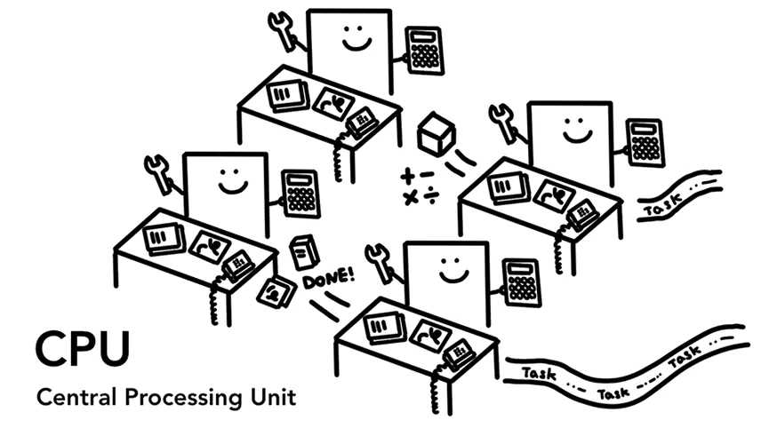

现代浏览器(part 1)

原文: https://developers.google.com/web/updates/2018/09/inside-browser-part1

## CPU, GPU, 内存, 多进程体系结构

在这4篇现代浏览器系列博客中，我们将深入探索谷歌浏览器从高层技术架构到渲染原理。如果你曾惊讶浏览器是如何将你的代码变成一个网站，或者你不确定为什使用一个特定的技术来改善性能，那么本系列适合你。

在该系列第1部分，我们将了解核心的计算机术语和谷歌浏览器的多进程技术架构。

> 注: 如果你对CPU/GPU和多进程/多线程非常熟悉，可以跳到<a href='#architecture'>浏览器架构</a>

## 计算机核心: CPU和GPU

为了更好地理解浏览器的运行环境，我们需要了解一些计算机部件并知道它们在做什么。

### CPU

首先是中央处理单元（CPU）。CPU可以想象为你计算机的大脑，一个CPU内核，就像图里的一位办公室工作人员，能一一处理许多不同的任务。它能处理数学到艺术的所有工作，同时又知道如何回复客户电话。过去大多数CPU是单芯片。内核就像在同一芯片中的另一个CPU。在现代硬件中，你通常会获得多个内核，从而为手机和笔记本电脑提供更多的计算能力。

图1：4核CPU就像办公室每个办公桌上工作人员，处理传入任务。

### GPU

图形处理单元（GPU）是另一个计算机部件，与CPU不同的是，GPU擅长处理简单任务，但同时跨多个内核。顾名思义，它最初是为处理图形而开发的。

## <a name='architecture'>浏览器技术架构</a>

